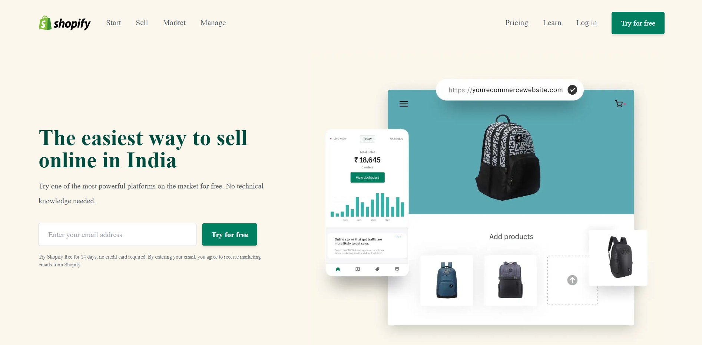

# Project Name : **Shopify Clone !**

### by Nisha Dewangan

In this project I have created a homepage of Shopify and it is clone of homepage of Shopify actual Website. I have taken the reference of Rode actual website for Creating this Project.

## 🛠 Technologies used

> HTML

> Tailwind CSS

### About this Project

In this project I have learnt about how to use class through Tailwind CSS and how to make responsive Website, how it will look in mobile screen, medium screen and large screen. It took almost 4 days for completion.

### Self Experience

After this project I have increased my self confidence.

### You can Check it Live on Below Link :

[Live Link !](https://nisha-shopify-clone.netlify.app/)

